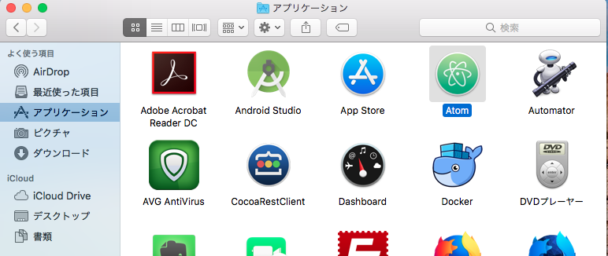
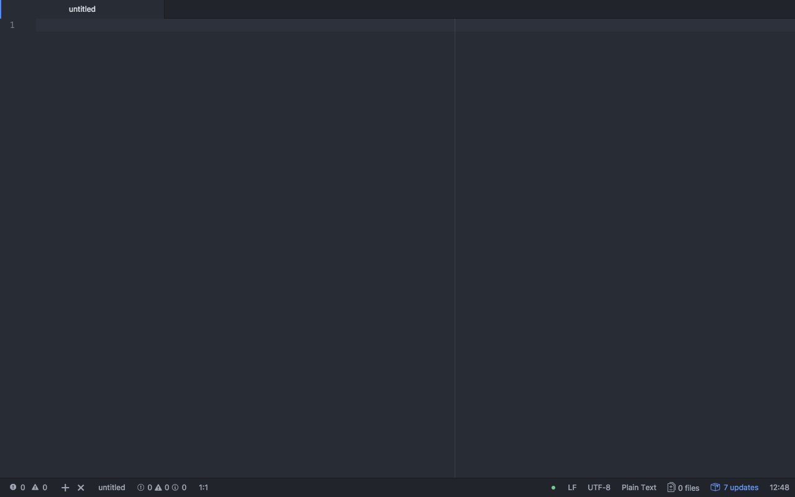

# 本レッスンのゴール

- GitHub 製高機能テキストエディター Atom のインストール完了

# 想定環境

以下の環境を想定しています。

- OS : MacOSX High Sierra （バージョン 10.13.14）

# 前提条件

- Homebrew がインストールされている事。

<attention>

Homebrew のインストール方法については、以下のリンク先を参照して下さい。

- <a href="https://startappdevfrom35.com/homebrewinstall/">HomeBrew のインストール</a>

</attention>

# 全体の流れ

以下の流れで進めます。

1. Atom のインストール
2. Atom の起動確認

<adsence></adsence>

# 作業

## 1. Atom のインストール

端末を起動し、以下のコマンドを実行します。

```bash
$ brew --cask install atom
```

特にエラー等出力されず、コマンドの実行が完了すれば、インストール完了です。

## 2. Atom の起動確認

1.  Finder->アプリケーションを開き、Atom のアイコンをクリックして Atom を起動します。



2. 以下の画面が表示されれば、Atom の起動確認完了です。


