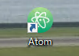

# 本レッスンのゴール

- GitHub 製高機能テキストエディター Atom のインストール完了

# 想定環境

以下の環境を想定しています。

- OS : Windows 10 64bit (Fall Creators Update 適用済）

# 前提条件

- Chocolatey がインストールされている事。

<attention>

Chocolatey のインストール方法については、以下のリンク先を参照して下さい。

- <a href="https://startappdevfrom35.com/chocolateyinstall/">Chocolatey のインストール</a>

</attention>

# 全体の流れ

以下の流れで進めます。

1. Atom のインストール
2. Atom の起動確認

<adsence></adsence>

# 作業

## 1. Atom のインストール

PowerShell を起動し、以下のコマンドを実行します。

```powershell
choco install atom
```

途中、以下のような質問があるので、Y と入力してリターンキーを押下します。

```powershell
Do you want to run the script?([Y]es/[N]o/[P]rint): Y
```

しばらくすると、インストーラーのダウンロードに続いて、インストールが行われます。
以下のような出力があれば、インストール完了です。

```powershell
The install of atom was successful.
Software installed as 'exe', install location is likely default.
```

## 2. Atom の起動確認

1.  Atom のアイコンをクリックして Atom を起動します。



2. 以下の画面が表示されれば、Atom の起動確認完了です。


