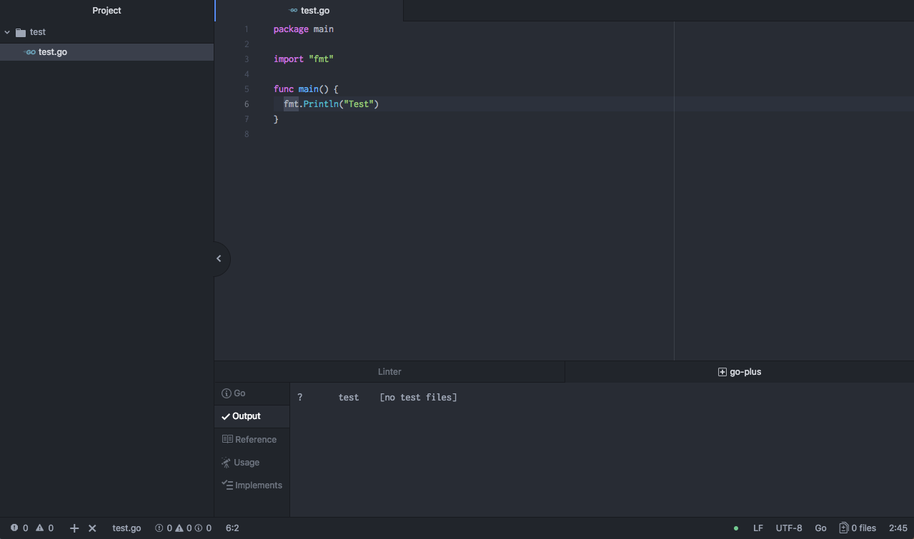

# 本レッスンのゴール

- Atom の Go 言語開発用設定を行い、簡単なプログラムを作成し動作確認する

# 想定環境

以下の環境を想定しています。

- OS : MacOSX High Sierra （バージョン 10.13.4）

# 前提条件

- Golang がインストールされている事
- Atom がインストールされている事

<attention>

各手順はそれぞれ、下記リンク先を参照してください。

- <a href="https://startappdevfrom35.com/godevenvformacos/">Golang インストール</a>手順
- <a href="https://startappdevfrom35.com/atominstallformacos/">Atom インストール手順</a>

</attention>

# 全体の流れ

以下の流れで進めます。

- 依存パッケージインストール
- Atom の関連パッケージインストール
- 動作確認

# インストール作業

## 1． 依存パッケージインストール

Atom のプラグイン側から必要とされる Go の依存パッケージ及び関連ツールを
以下のコマンドでインストールします。

```bash
$ go get golang.org/x/tools/cmd/goimports
$ go get github.com/nsf/gocode
$ go get github.com/rogpeppe/godef

$ brew install go-delve/delve/delve
```

## 2． Atom の関連パッケージインストール

以下のコマンドで、Atom の関連パッケージをインストールします。

```bash

$ apm install go-plus
$ apm install godef

```

## 3． 動作確認

以下のコマンドで GOHOME/src 下に適当なフォルダー（本記事では test）を作成します。

```bash

$ mkdir $GOPATH/src/test

```

次に Atom を起動し、作成したフォルダーを開き、Go のソースファイル
（本記事では、ファイル名：test.go）を作成し、以下のコードを記述します。

```python
package main

import &quot;fmt&quot;

func main() {
fmt.Println(&quot;Test&quot;)
}
```

ファイルを保存すると、自動的にコードの整形、チェック、コンパイルが走ります。
特にエラーが無ければ、以下の様な画面になります。



最後に、Terminal から以下のコマンドを実行し、以下の様な出力が得られれば動作確認完了です。

```bash
$ go run test.go
Test
```
