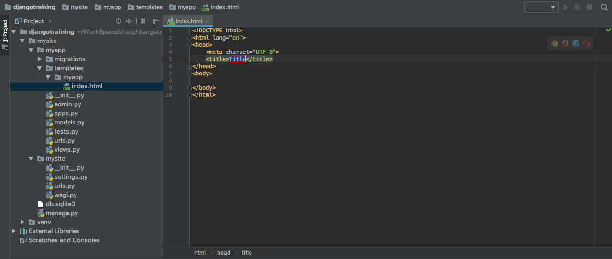
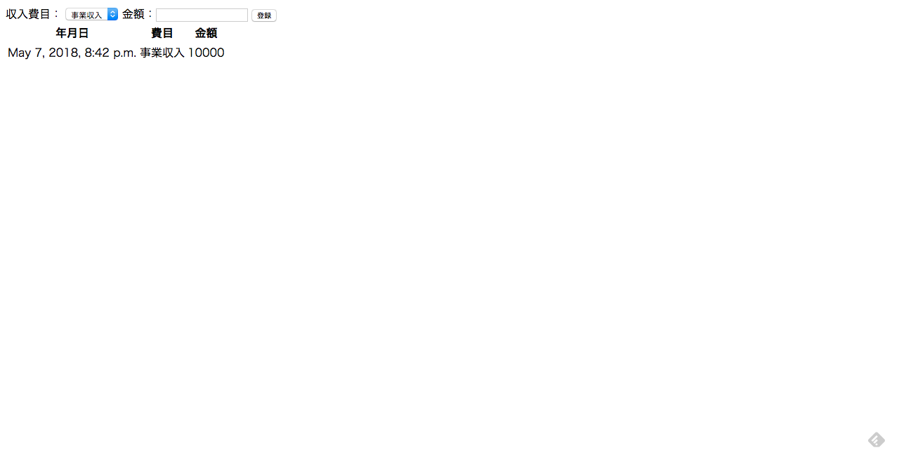

# 本レッスンのゴール

- DB への新規登録、参照の UI を実装し、Web アプリの形をざっくり作る。

# 前提条件

- （必須）Model を実装し、DB にマイグレーション済みである事。
- （推奨）Django Admin から DB の操作が出来るようになっている事。

<attention>

それぞれの手順は、以下のリンク先をご参照ください。

- <a href="https://startappdevfrom35.com/djangofirstdbappdbbuild/">Model の実装ならびにマイグレーション手順</a>
- <a href="https://startappdevfrom35.com/firstdjangoadmin/">Django Admin からの DB 操作を出来るようにする手順</a>

</attention>

# 全体の流れ

以下の流れで進めます。

1. テンプレートの実装
2. View の実装
3. ルーティング設定
4. 動作確認

<adsence></adsence>

# 作業

## 1. テンプレートの実装

Django における UI の生成は、テンプレートに対して値を埋め込む形で生成されます。
ここでは、費目と金額を入力して収入を記録し、一覧を表示する画面を想定します。
まず、以下のように、<highlight>myapp/templates/myapp に、index.html</highlight>を作成します。



これがテンプレートファイルです。このファイルに、以下のようにテンプレートを実装します。

```html
<!DOCTYPE html>
<html lang="jp">
  <head>
    <meta charset="UTF-8" />
    <title>Title</title>
  </head>
  <body>
    <form action="" method="post">
       収入費目：
      <select name="income_category">
        
        <option value="{{income_category.id}}">{{income_category.name}}</option>
        
      </select>
      金額：
      <input type="number" name="income_amount" />
      <input type="submit" value="登録" />
    </form>

    <table>
      　　　　　　　　
      <tr>
        <th>年月日</th>
        <th>費目</th>
        <th>金額</th>
      </tr>
       
      　　　　　　　　　　　　　　　　　　
      <tr>
        　　　　　　　　　　　　　　　　　　　　　　
        <td>{{income_record.ymd}}</td>
        　　　　　　　　　　　　　　　　　　　　　　
        <td>{{income_record.category}}</td>
        　　　　　　　　　　　　　　　　　　　　　
        <td>{{income_record.amount}}</td>
        　　　　　　　　　　　
      </tr>
       
    </table>
  </body>
</html>
```

これでテンプレートは実装完了です。

## 2. View の実装

次に、1.で実装したテンプレートを使って、

- ブラウザーの入力を DB に登録する
- DB に登録されたデータをブラウザーに表示する

処理を実装します。
<highlight>views.py</highlight>に、以下のコードを実装してください。

```python
from django.http import HttpResponse
from django.template import loader

from .models import IncomeCategory, Income

def index(request):

    # 収入費目リストを取得
    income_category_list = IncomeCategory.objects.all()

    if request.method == 'POST':
        # 収入費目を取得
        income_category = IncomeCategory.objects.get(pk=request.POST['income_category'])

        income_amount = request.POST['income_amount']
        income = Income(amount=income_amount, incomecategoryid=income_category)
        income.save()

    # 収入記録データを取得
    income_record_list = Income.objects.all()

    # HTMLテンプレートオブジェクトを取得
    template = loader.get_template('myapp/index.html')

    # テンプレートの表示に使うデータ
    context = {
        'income_category_list': income_category_list,
        'income_record_list': income_record_list,
    }

    return HttpResponse(template.render(context, request))

```

これで、View の実装は完了です。

## 3. ルーティングの設定

URL と View を紐付けるため、url.py に、以下のコードを実装します。

```python
from django.urls import path

from . import views

app_name = 'myapp'
urlpatterns = [
path('', views.index, name='index'),
]
```

以上でルーティングの設定は完了です。

## 4. 動作確認

最後に、動作確認を行います。
manage.py のあるディレクトリで、以下のコマンドを実行します。

```bash
$ python manage.py runserver
```

次に、ブラウザを起動し、http://127.0.0.1:8000/myappにアクセスします。
以下のような画面が表示されれば OK です。



次に、収入費目を選択し、金額を入力して「登録」ボタンを押下します。

以下のような画面が表示されれば、動作確認完了です。


