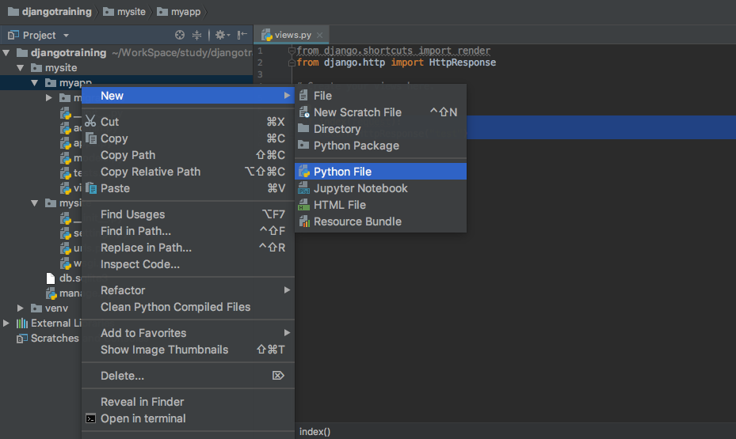
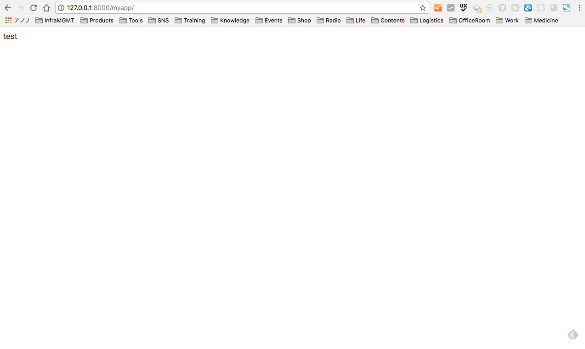

# 本レッスンのゴール

- Chrome などのブラウザに URL を打ち込み、アクセスするとブラウザに文字が表示される。

# 前提条件

- Django プロジェクトを作成済みである事

<attention>

Django プロジェクトの作成方法については、以下をご参照ください。

- <a href="https://startappdevfrom35.com/djangowebappdevprepare/">Django プロジェクト作成</a>

</attention>

# 全体の流れ

以下の流れで進めます。

1. アプリ作成の足場作り
2. View の実装
3. ルーティングの実装
4. 動作確認

<adsence></adsence>

# 作業

## 1. アプリ作成の足場作り

<attention>
以下、PyCharmを使うものとして説明を進めます。
</attention>

PyCharm でプロジェクトルートディレクトリ（manage.py があるディレクトリ）を開き
PyCharm の Terminal で以下のコマンドを実行します。

```bash
$ python manage.py startapp myapp
```

<attention>
myapp はアプリ名で、自由に設定出来ます。ここでは、myapp として解説を進めます。
</attention>

myapp ディレクトリ以下に、以下のようにディレクトリとファイルが生成されていれば、
アプリ作成の足場作りは完了です。

</div>

## 2. View の実装

次に、ブラウザから何らかの URL でアクセスした時に、画面に文字を表示する機能を実装します。
<highlight>myapp ディレクトリ直下の view.py ファイル</highlight>に、以下の内容を記述します。

```python
from django.http import HttpResponse

def index(request):
return HttpResponse(&quot;test&quot;)
```

## 3. ルーティングの実装

このままでは、先ほど実装した View に対してどういった URL でアクセスすれば良いのかわかりません。
そこで次に、ルーティングの実装を行います。
ルーティングとは、<highlight>URL と View の紐付けを定義</highlight>する事です。
たとえば、http://localhost/という URL のアクセスに対して、
先ほど実装した index(request)メソッドで定義した View を表示する、
といった事を定義します。

まず、アプリケーション用のルーティング定義ファイルを作成します。
下図のように、<highlight>myapp ディレクトリ直下</highlight>に、<highlight>urls.py</highlight>という名前で Python ファイルを新規に作成します。



作成した urls.py ファイルに、以下のコードを記述します。

```python
from django.urls import path

from . import views

urlpatterns = [
path('', views.index, name='index'),
]
```

最後に、先ほど実装した url.py がサーバー起動時に読み込まれるように、
プロジェクト直下の urls.py ファイルに、先ほど定義した urls.py への Path を追加します。

```python
from django.contrib import admin
from django.urls import include, path

urlpatterns = [
path('myapp/', include('myapp.urls')),
path('admin/', admin.site.urls),
]
```

以上で、ルーティングの実装は完了です。

## 4. 動作確認

続いて PyCharm の Terminal にて以下のコマンドを実行し、

Django 組み込みのテスト用サーバーを起動します。

```python

$ cd mysite
$ python manage.py runserver

```

ブラウザを起動して<highlight>http://127.0.0.1:8000/myapp</highlight>にアクセスし、
以下のような画面が表示されれば、動作確認完了です。


