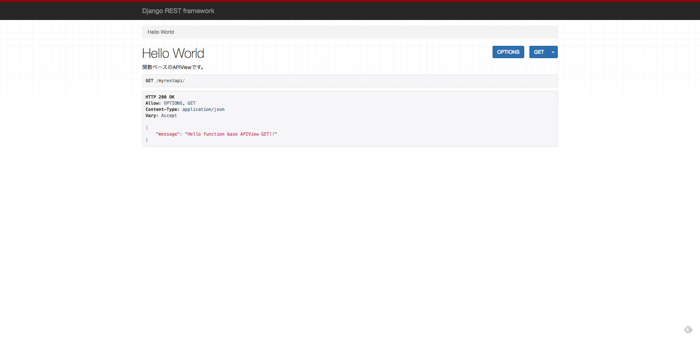
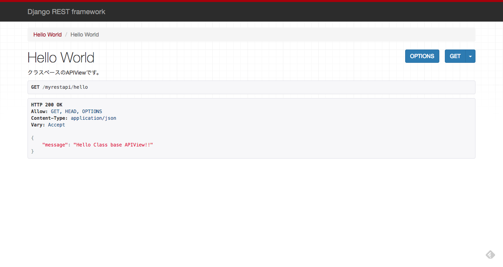

# 本レッスンのゴール

URL に応じて文字を返す GET メソッドを実装する。

<point>

GET, POST とは HTTP のメソッドで、主な用途は以下の通りです。

- GET : （サーバー等から）情報を取得
- POST : （データベース等に）新規に情報を生成

</point>

# 前提条件

Django REST framework による Web サービス開発の足場作りが完了している事。

<attention>

手順は、以下をご参照下さい。

- <a href="https://startappdevfrom35.com/djangorestframeworkwebservicedevprepare/">Django REST framework による Web サービス開発の足場作り</a>

</attention>

# 全体の流れ

以下の流れで進めます。

1. アプリケーションベースの作成
2. プロジェクトの設定
3. View の実装
4. ルーティングの実装
5. 動作確認

<adsence></adsence>

# Exercise

## 1. アプリケーションベースの作成

PyCharm を起動して、<a href="https://startappdevfrom35.com/djangorestframeworkwebservicedevprepare/">Django REST framework による Web サービス開発の足場作り</a>で作成した
プロジェクトのフォルダーを開き、以下のような画面を表示します。


次に、Terminal で、以下のコマンドを実行します、

```bash
$ cd myservice
$ python manage.py startapp myrestapi
```

<attention>
myrestapi はアプリ名です。任意の名前を設定可能です。
</attention>

以下の様に、myrestapi フォルダーとその下に関連ファイルが生成されていれば
アプリケーションベースの作成は完了です。


## 2. プロジェクトの設定

次に、myservice/settings.py を開き、INSTALLED_APPS に、
これから作成するアプリケーションのエントリーを以下の様に追加します。

```python
...
INSTALLED_APPS = [
    'myrestapi.apps.MyrestapiConfig',
    'rest_framework',
    ...
]
...
```

以上で、プロジェクトの設定は完了です。

## 3. View の実装

次に、View を実装します。View の実装には、クラスベースと関数ベースの２通りがあります。
両者のメリット、使い分け等詳しくは後々解説いたします。
今の時点では、View の実装にはこれら２つの方法があるという事を頭の片隅に置いておいてください。
今回はそれぞれの方法で実装してみます。
myrestapi/views.py に以下のコードを実装してください。

```python
rom rest_framework.views import APIView
from rest_framework.decorators import api_view
from rest_framework.response import Response


class HelloWorld(APIView):
    """
    クラスベースのAPIViewです。
    """
    def get(self, request, format=None):
        return Response({"message": "Hello Class base APIView!!"})


@api_view()
def hello_world(request):
    """
    関数ベースのAPIViewです。
    """
    print(request)
    return Response({"message": "Hello function base APIView!!"})

```

以上で、View の実装は完了です。

## 4. ルーティングの実装

次に、URL と View を結びつけるために、ルーティングの実装を行います。
myrestapi フォルダー直下に、urls.py ファイルを作成し、以下のコードを実装してください。

```python
from django.urls import path

from . import views

urlpatterns = [
    path('', views.hello_world, name='hello'),
    path('hello', views.HelloWorld.as_view(), name='test-get')
]
```

次に、上記ファイルの内容を読み込むため、myservice/urls.py に以下のコードを実装してください。

```python
...
from django.urls import path, include

urlpatterns = [
    path('myrestapi/', include('myrestapi.urls')),
    path('admin/', admin.site.urls),
]
```

以上で、ルーティングの実装は完了です。

## 5. 動作確認

Terminal にて以下のコマンドでテスト用サーバーを起動します。

```bash
$ python manage.py runserver
```

ブラウザを立ち上げ、http://127.0.0.1:8000/myrestapiにアクセスすると
以下のような画面が表示されるかと思います。



最後に、http://127.0.0.1:8000/myrestapi/helloにアクセスしてみてください。
次のような画面が表示されるかと思います。



以上で、本レッスンを終了します。
