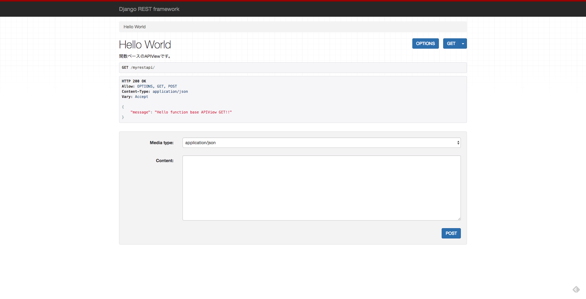
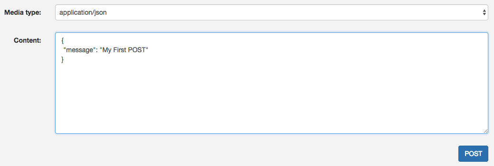
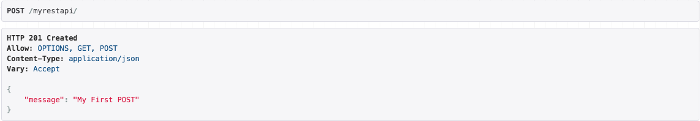
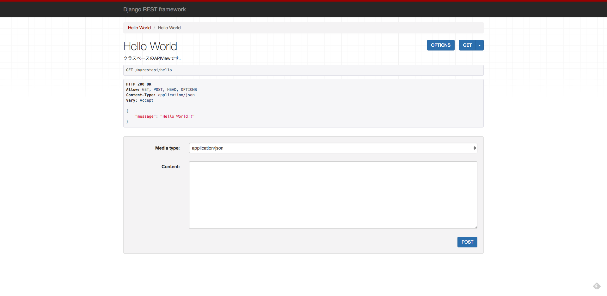
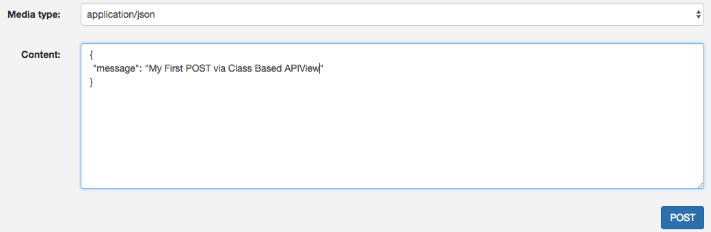
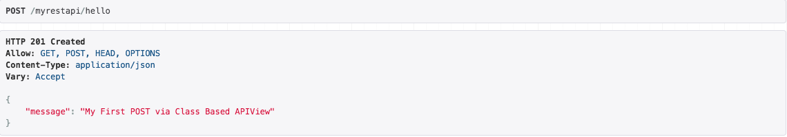

# 本レッスンのゴール

- POST に対応した簡単な WebAPI を実装する。

<point>

GET, POST とは HTTP のメソッドで、主な用途は以下の通りです。

- GET : （サーバー等から）情報を取得
- POST : （データベース等に）新規に情報を生成

</point>

# 前提条件

- Django REST framework による Web サービス開発の足場作りが完了している事。
- アプリケーションベースが既に作成済みである事。

<attention>

それぞれの手順は、以下をご参照ください。

- <a href="https://startappdevfrom35.com/djangorestframeworkwebservicedevprepare/">Django REST framework による Web サービス開発の足場作り</a>
- <a href="https://startappdevfrom35.com/djangorestframeworkwebservicedevfirsthttpget/">アプリケーションベースの作成</a>

</attention>

# 全体の流れ

以下の流れで進めます。

1. View の実装
2. 動作確認

<adsence></adsence>

# アクション

## 1. View の実装

<a href="https://startappdevfrom35.com/djangorestframeworkwebservicedevfirsthttpget/">こちら</a>で実装した myrestapi/views.py に、以下のコードを実装します。

```python
from rest_framework.views import APIView
from rest_framework.decorators import api_view
from rest_framework.response import Response

from rest_framework import status

class HelloWorld(APIView):
&quot;&quot;&quot;
クラスベースの APIView です。
&quot;&quot;&quot;
def get(self, request, format=None):
return Response({&quot;message&quot;: &quot;Hello World!!&quot;},
status=status.HTTP_200_OK)

    def post(self, request, format=None):
        request_data = request.data
        return Response({&quot;message&quot;: request_data[&quot;message&quot;]},
                        status=status.HTTP_201_CREATED)

@api_view(['GET', 'POST'])
def hello_world(request):
&quot;&quot;&quot;
関数ベースの APIView です。
&quot;&quot;&quot;
if request.method == 'GET':
return Response({&quot;message&quot;: &quot;Hello function base APIView GET!!&quot;},
status=status.HTTP_200_OK)
elif request.method == 'POST':
if request.data:
request_data = request.data
return Response({&quot;message&quot;: request_data[&quot;message&quot;]},
status=status.HTTP_201_CREATED)
```

主な追加実装内容は、POST でのアクセスに対応する処理と、レスポンスコードの指定です。

ここまでで、View の実装は完了です。

## 3. 動作確認

Terminal にて以下のコマンドでテスト用サーバーを起動します。

```bash
$ python manage.py runserver
```

ブラウザを起動し、http://127.0.0.1:8000/myrestapiにアクセスすると
以下のような画面が表示されます。



次に、Content のテキストボックスに以下のように入力して POST ボタンを押下します。



すると、以下のような画面が表示されるかと思います。



これで、関数ベースの APIView の POST の動作確認は完了です。
次に、クラスベースの APIView の動作確認を行います。
http://127.0.0.1:8000/myrestapi/helloにアクセスしてください。



Content に以下のように入力して POST を押下します。



すると、以下のような画面が表示されるかと思います。



これで、クラスベースの APIView の POST の動作確認完了です。

以上で、POST の動作確認は終了です。
