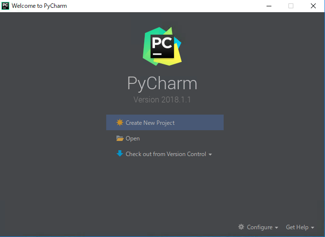
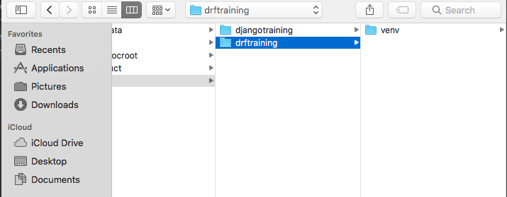
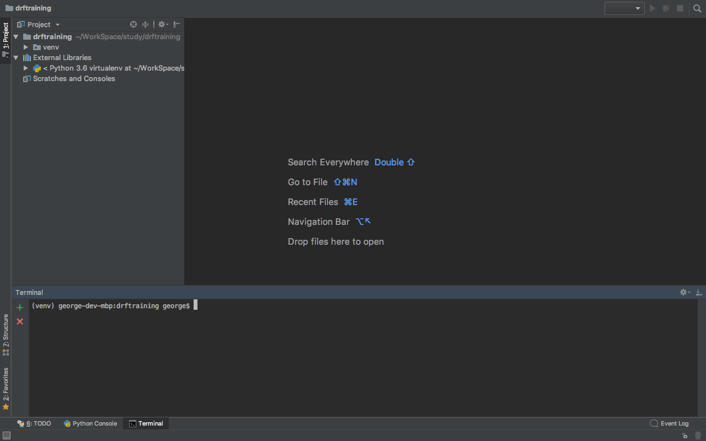
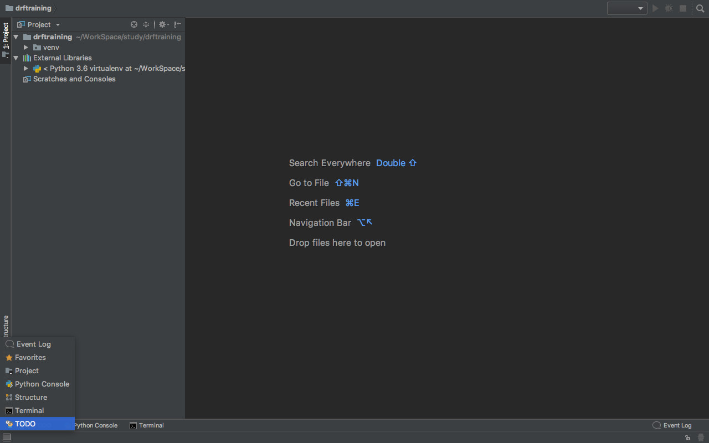
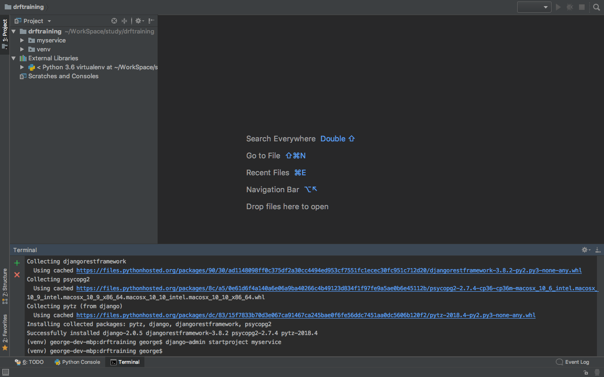
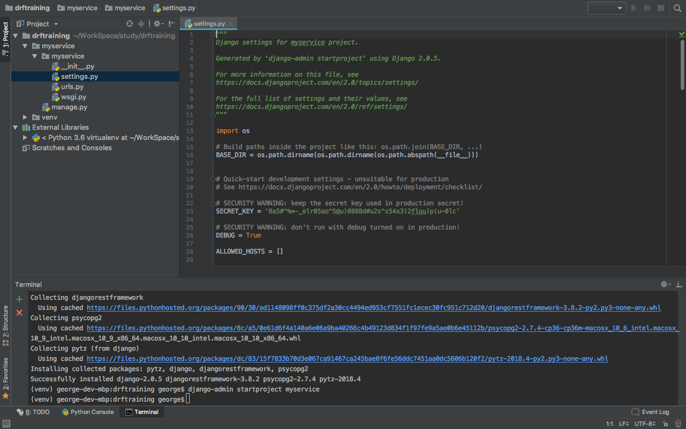

# 本レッスンのゴール

- Django REST framework による Web サービス開発の足場作り

# 前提条件

- Python3.4 以降がインストールされている事。（必須）
- PostgreSQL がインストールされ、起動している事。（必須）
- PyCharm がインストールされている事。（推奨）

<attention>

インストール方法について、それぞれ以下のリンク先をご参照ください。

- Mac な方

  - <a href="https://startappdevfrom35.com/pythondevenvformacos/">MacOS への Python インストール</a>
  - <a href="https://startappdevfrom35.com/postgresqlinstallformac/">PostgreSQL のインストール</a>
  - <a href="https://startappdevfrom35.com/pycharminstallformacos/">MacOS への PyCharm インストール</a>

- Windows な方

  - <a href="https://startappdevfrom35.com/pythondevenvinstallforwindows/">Windows への Python インストール</a>
  - <a href="https://startappdevfrom35.com/pycharminstallforwindows/">Windows への PyCharm インストール</a>

</attention>

# 全体の流れ

以下の流れで進めます。

1. プロジェクト用のデータベース作成
2. プロジェクト固有の Python 実行環境構築
3. (PyCharm 使用の場合）PyCharm プロジェクト作成
4. ライブラリー群の導入
5. Django プロジェクト作成
6. 動作確認

<adsence></adsence>

# アクション

## 1. プロジェクト用データベース作成

まず、以下のコマンドで、プロジェクト用のデータベースユーザーを作成します。
尚、<span class="highlight">パスワードを２回尋ねられるので、2 回とも同じ文字列を入力して下さい。</span>

```bash
$ createuser -S -d -R -P djangorestuser
Enter password for new role:
Enter it again:
```

<point>

それぞれのオプションの意味は以下の通りです。

-S : スーパーユーザー権限を与えない
-d : データベース作成権限を与える
-R : ユーザー作成権限を与えない
-P : パスワードを設定する

</point>
ユーザーが作成された事を、以下の様に確認します。

```bash

$ psql postgres
psql (10.3)
Type &quot;help&quot; for help.

postgres=# \du
List of roles
Role name | Attributes | Member of
----------------+------------------------------------------------------------+-----------
djangorestuser | Create DB | {}

```

次に、以下のコマンドで、プロジェクト用のデータベースを作成します。

```bash
$ createdb -O djangorestuser djangorestdb
```

以下のコマンドで、データベースが作成された事を確認して
プロジェクト用データベースの作成は完了です。

```bash
$ psql -l
List of databases
Name | Owner | Encoding | Collate | Ctype | Access privileges
--------------+----------------+----------+-------------+-------------+-------------------
djangorestdb | djangorestuser | UTF8 | en_US.UTF-8 | en_US.UTF-8
```

## 2. プロジェクト固有の Python 実行環境構築

プロジェクト用のディレクトリを作成し、作成したディレクトリで以下のコマンドを実行します。

```bash

$ mkdir drftraining
$ cd drftraining
$ python -m venv venv

```

## 3. PyCharm プロジェクト作成

PyCharm を起動し、「Open」をクリックします。


ダイアログが表示されるので、先ほど作成したディレクトリを選択し、
OPEN ボタンを押下して下さい。



以下のような画面が出れば OK です。



## 4. ライブラリー群導入

プロジェクトに以下のライブラリーを導入します。

- django : Django 本体
- djangorestframework : Django REST framework 本体
- psycopg2-binary : Python 用 PostgreSQL ドライバー（PostgreSQL の操作に必要）

まず、PyCharm の左下のメニューより、Terminal を起動します。



下のように Terminal が起動したら、以下のコマンドで Django をプロジェクトに導入します。

```bash
$ pip install django djangorestframework psycopg2-binary
```


以下のように出力されれば、Django のプロジェクトへの導入は完了です。

```bash
Successfully installed django-2.0.5 djangorestframework-3.8.2 psycopg2-binary-2.7.4 pytz-2018.4
```

## 5. Django プロジェクト作成

Django REST framework は、Django のプロジェクトがベースになるので、
ここで Django プロジェクトの作成を行います。 4.の作業に続いて、PyCharm の Terminal にて、以下のコマンドを実行します。

```bash
$ django-admin startproject myservice
```

<attention>
myservice はプロジェクト名です。ここでは myservice として説明を進めます。
</attention>

以下のように、プロジェクト名のフォルダと配下にファイルが生成されていれば、
Django プロジェクト作成完了です。



次に、データベースの接続先、言語、時刻の設定を行います。以下の様に、
drftraining/myservice/myservice/settings.py を開きます。



まず、INSTALLED_APPS に以下の様に rest_framework を追加します。

```python
INSTALLED_APPS = [
'rest_framework',
'django.contrib.admin',
'django.contrib.auth',
'django.contrib.contenttypes',
'django.contrib.sessions',
'django.contrib.messages',
'django.contrib.staticfiles',
]
```

次に、DATABASES の部分を以下の様に書き換えます。

```python
DATABASES = {
'default': {
'ENGINE': 'django.db.backends.postgresql',
'NAME': 'djangorestdb',
'USER': 'djangorestuser',
'PASSWORD': 'password',
'HOST': '127.0.0.1',
'PORT': '5432',
}
}
```

次に、LANGUAGE_CODE, TIME_ZONE を以下の様に書き換えます。

```python
LANGUAGE_CODE = 'ja-jp'

TIME_ZONE = 'Asia/Tokyo'
```

最後に、以下のコマンドを実行し、データベースにマイグレーションを行います。

```bash
$ cd myservice
$ python manage.py migrate
```

以下の様にして、PostgreSQL に接続して、マイグレーションが行われたかを確認します。

```bash
$ psql djangoresstdb -U djangorestuser
psql (10.3)
Type &quot;help&quot; for help.

djangorestdb=&gt; \dt;
List of relations
Schema | Name | Type | Owner
--------+----------------------------+-------+----------------
public | auth_group | table | djangorestuser
public | auth_group_permissions | table | djangorestuser
public | auth_permission | table | djangorestuser
public | auth_user | table | djangorestuser
public | auth_user_groups | table | djangorestuser
public | auth_user_user_permissions | table | djangorestuser
public | django_admin_log | table | djangorestuser
public | django_content_type | table | djangorestuser
public | django_migrations | table | djangorestuser
public | django_session | table | djangorestuser
(10 rows)

```

これで、Django プロジェクトの作成は完了です。

## 6. 動作確認

続いて PyCharm の Terminal にて以下のコマンドを実行し、
Django 組み込みのテスト用サーバーを起動します。

```bash
$ python manage.py runserver
```

以下のような出力が出れば、サーバーが無事起動しています。

```bash
Performing system checks...

System check identified no issues (0 silenced).
May 16, 2018 - 06:24:11
Django version 2.0.5, using settings 'myservice.settings'
Starting development server at http://127.0.0.1:8000/
Quit the server with CONTROL-C.
```

最後に、ブラウザを起動し、http://127.0.0.1:8000にアクセスし、
画面が表示されれば、Django REST framework による
Web サービス開発の足場作りは完了です。
