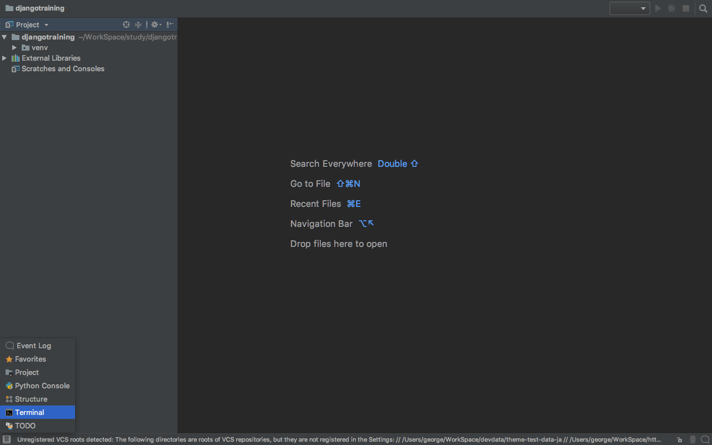

# 本レッスンのゴール

- フルスタック Web アプリケーションフレームワーク Django による Web アプリケーション開発プロジェクトの作成

# 前提条件

- Python3.4 以降がインストールされている事。（必須）
- PyCharm がインストールされている事。（推奨）

<attention>

インストール方法について、それぞれ以下のリンク先をご参照ください。

- MacOS の方

  - <a href="https://startappdevfrom35.com/pythondevenvformacos/">MacOS への Python インストール</a>
  - <a href="https://startappdevfrom35.com/pycharminstallformacos/">MacOS への PyCharm インストール</a>

- Windows の方

  - <a href="https://startappdevfrom35.com/pythondevenvinstallforwindows/">Windows への Python インストール</a>
  - <a href="https://startappdevfrom35.com/pycharminstallforwindows/">Windows への PyCharm インストール</a>

</attention>

# 全体の流れ

以下の流れで進めます。

1. プロジェクト固有の Python 実行環境構築
2. (PyCharm 使用の場合）PyCharm プロジェクト作成
3. プロジェクトに Django 導入
4. Django プロジェクト作成
5. 動作確認

<adsence></adsence>

# 作業

## 1. プロジェクト固有の Python 実行環境構築

プロジェクト用のディレクトリを作成し、作成したディレクトリで以下のコマンドを実行します。

```bash
$ python -m venv venv
```

## 2. PyCharm プロジェクト作成

PyCharm を起動し、「Open」をクリック、


先ほどのディレクトリを選択。以下のような画面が出れば OK。


## 3. Django 導入

左下のメニューより、Terminal を起動します。



下のように Terminal が起動したら、以下のコマンドで Django をプロジェクトに導入します。

```bash
$ pip install django
```


以下のように出力されれば、Django のプロジェクトへの導入は完了です。

```bash

Successfully installed django-2.0.4 pytz-2018.4

```

## 4. Django プロジェクト作成

3.の作業に続いて、PyCharm の Terminal にて、以下のコマンドを実行します。

```bash

$ django-admin startproject mysite

```

<point>mysite はプロジェクト名です。ここでは mysite として説明を進めます。</point>
以下のように、プロジェクト名のフォルダと配下にファイルが生成されていれば、
Django プロジェクト作成完了です。


## 5. 動作確認

続いて PyCharm の Terminal にて以下のコマンドを実行し、

Django 組み込みのテスト用サーバーを起動します。

```bash

$ cd mysite
$ python manage.py runserver

```

以下のような出力が出れば、サーバーが無事起動しています。

```bash

Performing system checks...

System check identified no issues (0 silenced).

You have 14 unapplied migration(s). Your project may not work properly until you apply the migrations for app(s): admin, auth, contenttypes, sessions.
Run 'python manage.py migrate' to apply them.

April 12, 2018 - 11:11:37
Django version 2.0.4, using settings 'mysite.settings'
Starting development server at http://127.0.0.1:8000/
Quit the server with CONTROL-C.

```

<attention>
以下のような警告がありますが、これはデータベースにデータをマイグレーション（移行）していない為に生じるものです。
今回の動作確認ではとりあえず必要ありませんので、一旦無視して進めて下さい。

```bash
You have 14 unapplied migration(s). Your project may not work properly until you apply the migrations for app(s): admin, auth, contenttypes, sessions. Run 'python manage.py migrate' to apply them.
```

</attention>

最後に、ブラウザを起動し、http://127.0.0.1:8000にアクセスし、

以下のような画面が表示されれば、Django による Web アプリケーション開発の準備は完了です。


次からはいよいよ、このプロジェクトに、Web アプリケーションを実装します。
