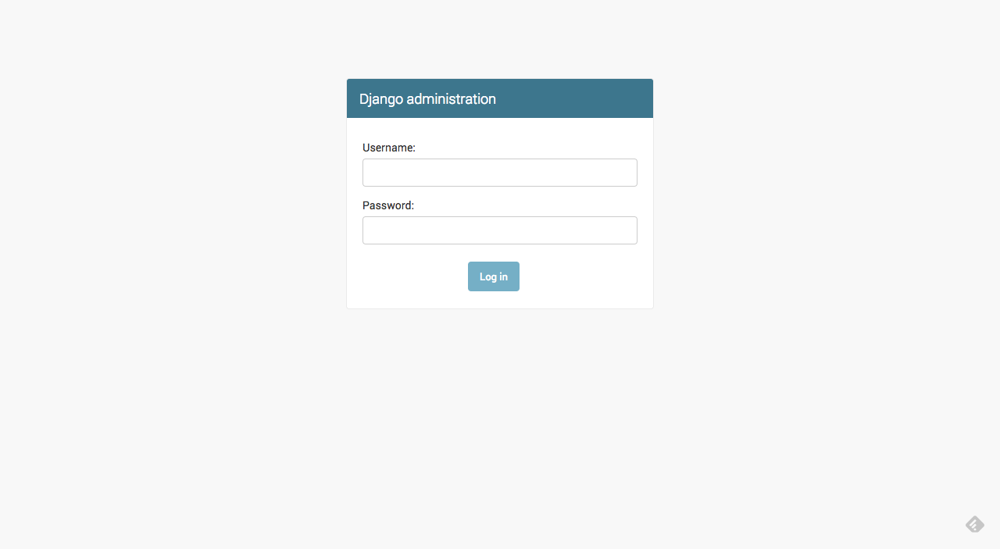
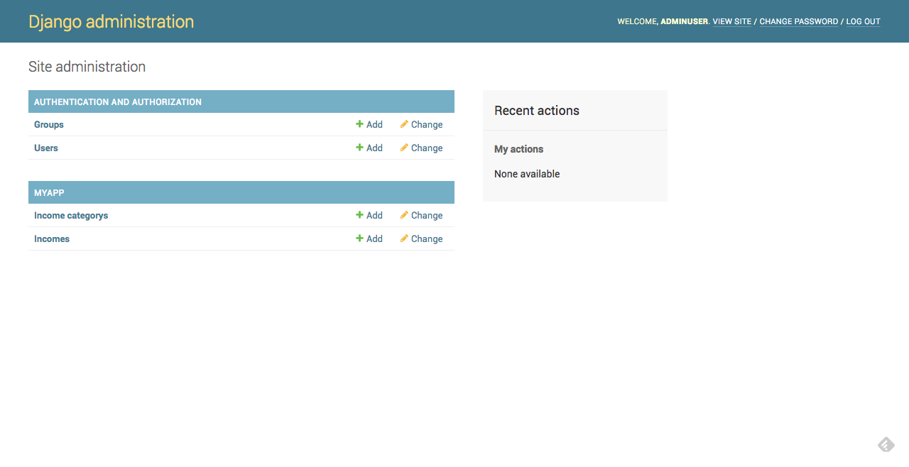
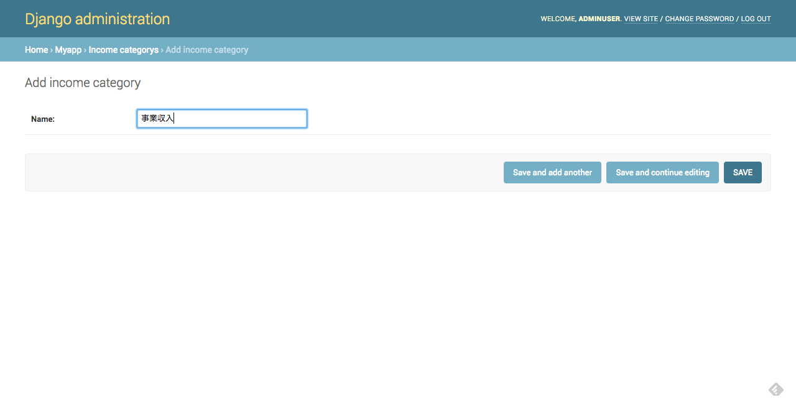
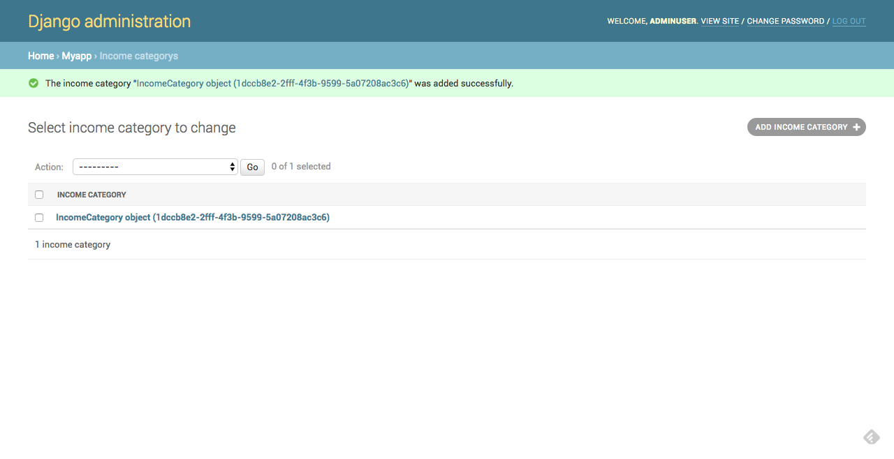
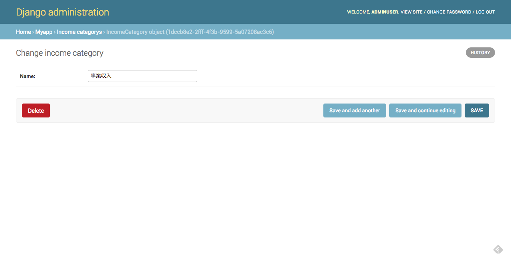
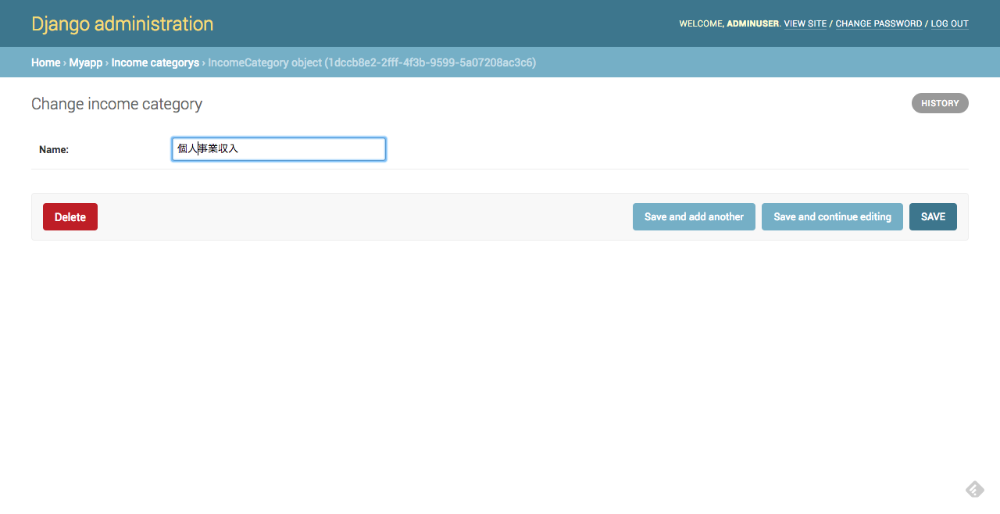
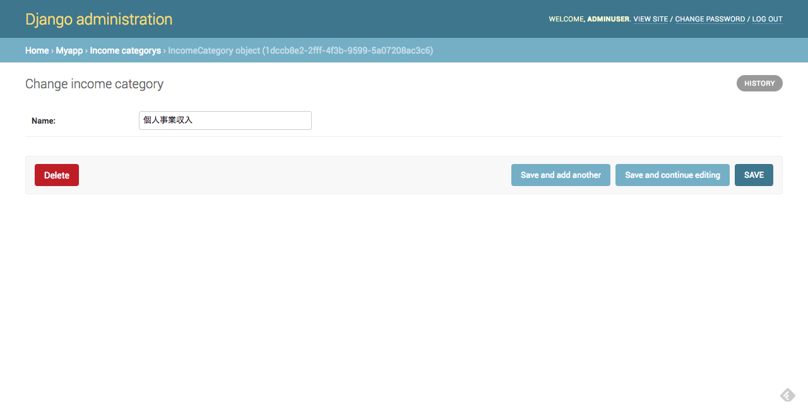
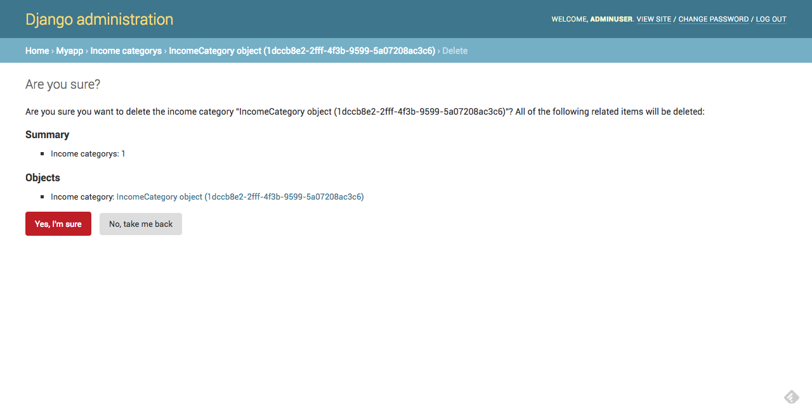
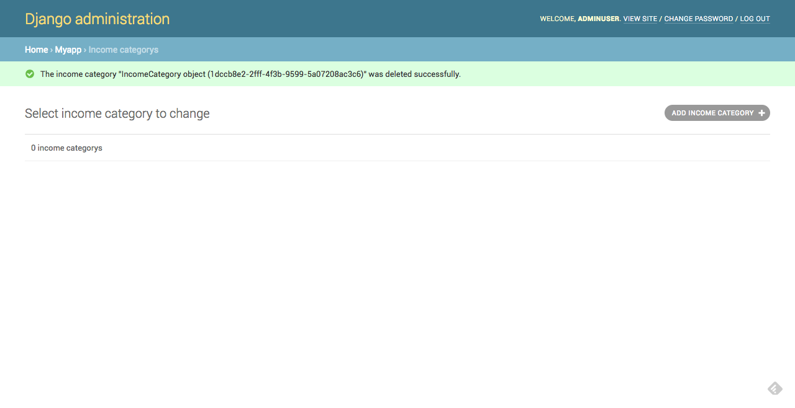

# 本レッスンのゴール

- Django Admin で、DB のテーブルのレコードを作成、参照、編集、削除ができるようになる。

# 前提条件

- Model を実装し、DB にマイグレーション済みである事。

<attention>

Model の実装方法ならびに DB へのマイグレーション方法は、以下をご参照ください。

- <a href="https://startappdevfrom35.com/djangofirstdbappdbbuild/" target="_blank" rel="noopener">Model の実装ならびにマイグレーション手順</a>

</attention>

# 全体の流れ

以下の流れで進めます。

1. Django Admin の Superuser Account 作成
2. Django Admin の管理対象 Model 追加
3. 動作確認

<adsence></adsence>

# 作業

## 1. Django Admin の Superuser Account 作成

PyCharm の Terminal にて、manage,py のあるディレクトリに移動し、
以下のコマンドを実行します。

```bash
$ python manage.py createsuperuser
```

Username を尋ねられるので、入力して Enter を押下します。
ここでは、AdminUser として進めます。

```bash

Username (leave blank to use 'UserName'): AdminUser

```

（注：'UserName'は、現在 OS にログイン中のユーザー名が表示されます。）

次に、E-mail アドレスを尋ねられるので、入力して Enter を押下します。
ここでは、adminuser@admin.comとして進めます。

```bash
Email address: adminuser@admin.com
```

最後に、設定するパスワードを２回尋ねられるので、
２回とも同じパスワードを入力し、Enter を押下します。

```bash
Password:********
Password (again):********
```

<attention>
********の部分は実際には表示されません

尚、Password など、ありふれた単語を設定しようとすると、
以下の警告が表示され、再度入力を促されるので、
推測されにくい文字列を入力してください。

```bash
This password is too common.
```

</attention>

以下の表示が出力されれば、Superuser Account の作成は完了です。

```bash
Superuser created successfully.
```

## 2. Django Admin の管理対象 Model 追加

次に、myapp/admin.py に以下の記述を加え、Django Admin の管理対象 Model を追加します。

```python
from django.contrib import admin

from .models import IncomeCategory, Income

admin.site.register(IncomeCategory)
admin.site.register(Income)
```

<adsence></adsence>

## 3. 動作確認

manage.py のあるディレクトリにて以下のコマンドを実行し、
Django 組み込みのテスト用サーバーを起動します。

```bash
$ python manage.py runserver
```

ブラウザを立ち上げ、URL にhttp://127.0.0.1:8000/adminと入力して
Enter を押下すると、以下の画面が表示されるので、
手順 1 で作成した Superuser Account の Username と Password を入力し
「Log in」ボタンを押下します。



ログインに成功すると、以下のような画面が表示されます。



ここでは、MYAPP の「Income categorys」モデルについて操作を行なってまいります。
まずは、レコードの新規作成です。
先ほどの画面で、MYAPP の「Income categorys」の「<highlight>+Add</highlight>」をクリックすると、
以下のような画面が表示されるので、Name の所に入力して「<highlight>SAVE</highlight>」ボタンを押下
してください。



以下のような画面が表示されれば、新規レコード作成は成功です。



次に、先程の画面で、「INCOME CATEGORY」下の「IncomeCategory object (...)」
をクリックすると、以下のような画面が表示されます。



NAME に、先ほど入力した文字列が表示されている事が確認出来ると思います。
これで、レコード参照も成功です。
次に、レコード更新を行います。以下のように、NAME の所に別の文字列を入力し、
「SAVE」ボタンを押下します。（ここでは仮に、個人事業収入とします。）



すると、新規登録時と同じように、次のような画面が表示されます。


この画面の、「INCOME CATEGORY」下の「InceomCategory object (...)」をクリックすると、
以下のような画面が表示され、NAME の所に先ほど入力した文字列が表示されていれば
レコード更新成功です。



最後に、レコード削除を行います。先程の画面で、「<highlight>DELETE</highlight>」ボタンを押下します。

すると、以下のような画面が表示され、本当に消しても良いのか尋ねられるので、

「<highlight>Yes, I'm sure.</highlight>」ボタンを押下します。



すると以下のような画面が表示され、レコードが削除されている事が確認出来るかと思います。



以上で、Django Admin を使った DB のレコード新規登録、参照、更新、削除の
動作確認は完了です。
