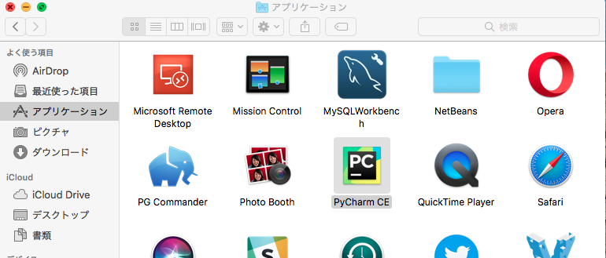
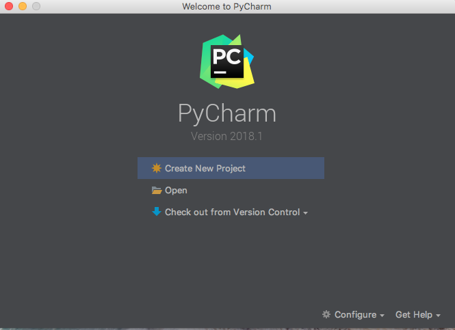
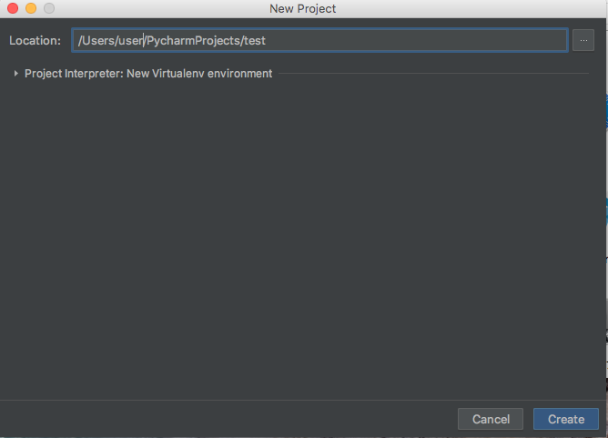
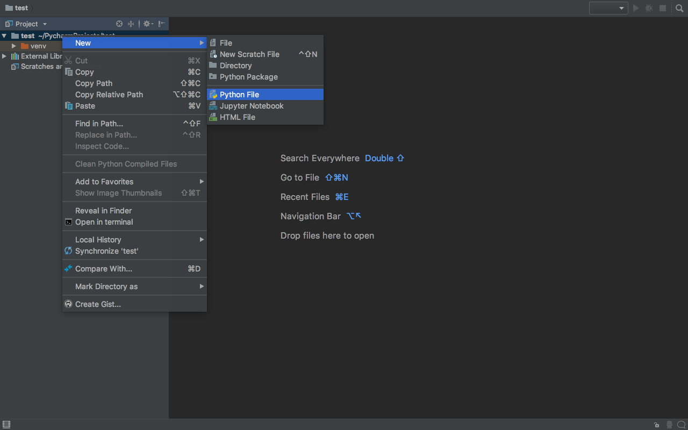
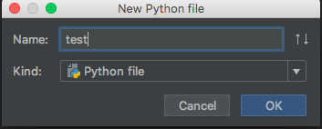

# 本レッスンのゴール

- Python 統合開発環境 PyCharm のインストール
- 動作確認をかねて、簡単な Python プログラムの作成と実行

# 想定環境

以下の環境を想定しています。

- OS : MacOSX High Sierra （バージョン 10.13.14）

# 前提条件

- Homebrew-Cask がインストールされている事。
- Python がインストールされている事。

<attention>

それぞれのインストール方法については、以下のリンク先を参照して下さい。

- <a href="https://startappdevfrom35.com/homebrewinstall/">HomeBrew のインストール</a>
- <a href="https://startappdevfrom35.com/pythondevenvformacos/">Python のインストール</a>

</attention>

#   全体の流れ

以下の流れで進めます。

- PyCharm のインストール
- PyCharm の動作確認

# 作業

## 1. PyCharm のインストール

端末を起動し、以下のコマンドを実行します。

尚、ここでは、無料版の PyCharm Community Edition をインストールするものとします。

```bash
$ brew cask install pycharm-ce
```

<point>

有料版の PyCharm をインストールする場合は、以下のコマンドを実行します。

```bash
$ brew cask install pycharm
```

</point>

特にエラー等出力されず、コ
マンドの実行が完了すれば、インストールは完了です。

## 2. PyCharm の動作確認

1.Finder->アプリケーションを開き、PyCharm のアイコンをクリックして PyCharm を起動します。



2.「Create New Project」をクリックします。



3.「Create」ボタンを押下します。



4.プロジェクトルートフォルダーを右クリック →New→Python File をクリック



5.適当なファイル名を入力し、「OK」ボタンを押下



6.以下のコードを記述

```python
print(`Hello, World`)
```

7.左下より Terminal を起動


8.ターミナルに以下のコマンドを入力

```bash
$ python ファイル名.py
```

以下のように出力されれば、動作確認完了

```bash
Hello World!
```
