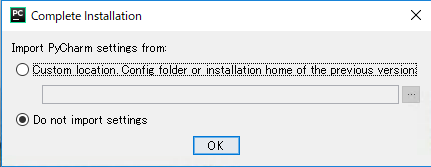
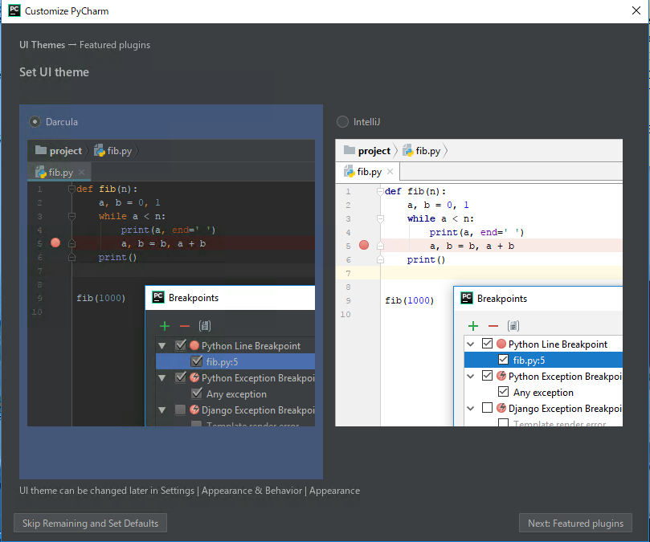
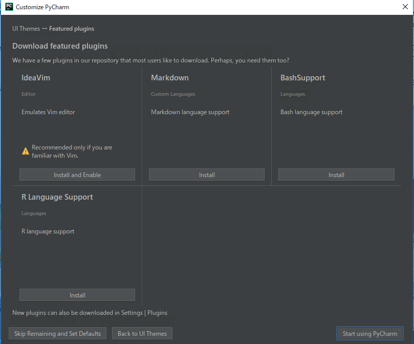
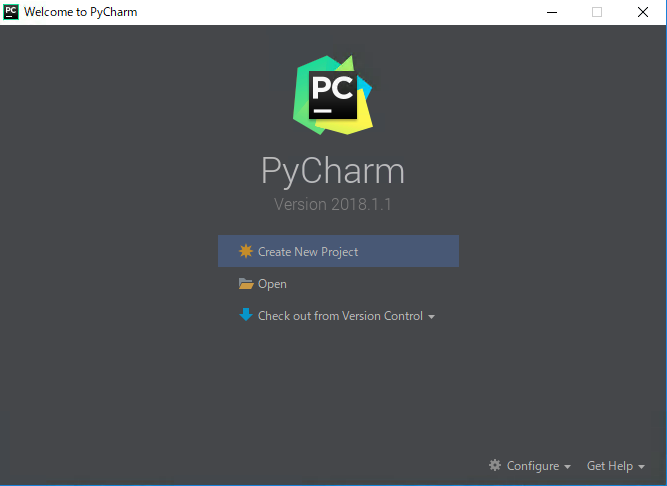
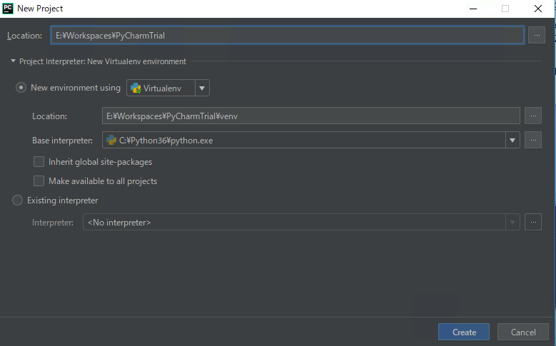
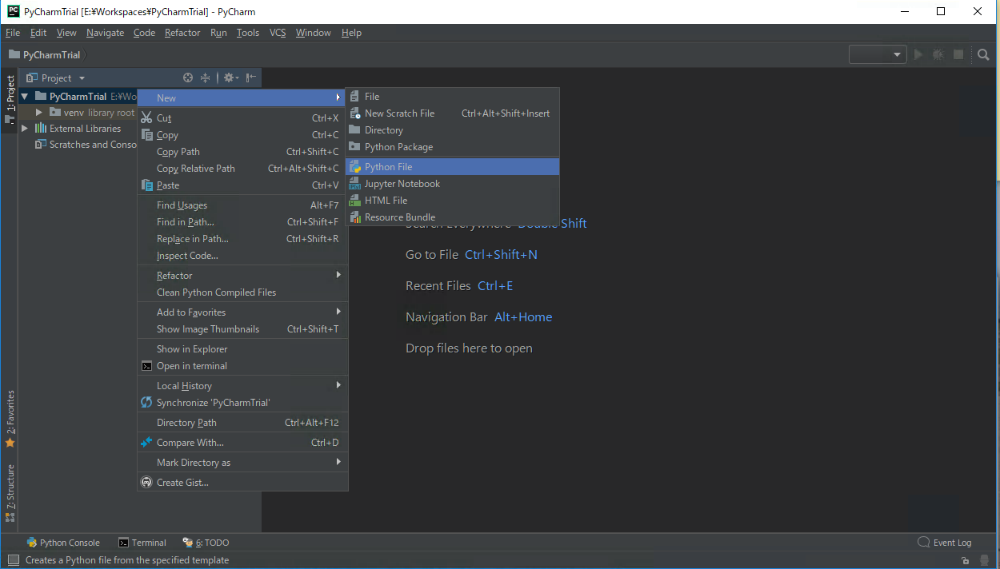
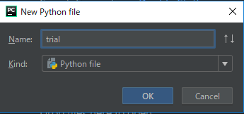
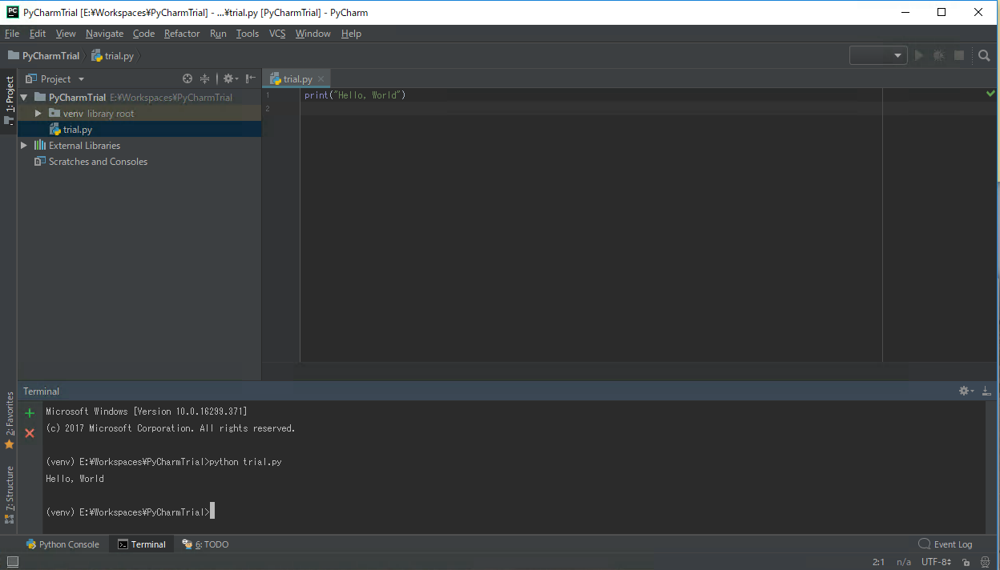

# 本レッスンのゴール

- Python 統合開発環境 PyCharm のインストール
- 動作確認をかねて、簡単な Python プログラムの作成と実行

# 想定環境

以下の環境を想定しています。

- OS : Windows 10 64bit (Fall Creators Update 適用済）

# 前提条件

- Chocolatey がインストールされている事。
- Python がインストールされている事。

<attention>

それぞれのインストール方法については、以下のリンク先を参照して下さい。

- <a href="https://startappdevfrom35.com/chocolateyinstall/">Chocolatey のインストール</a>
- <a href="https://startappdevfrom35.com/pythondevenvinstallforwindows/">Python のインストール</a>

</attention>

#   全体の流れ

以下の流れで進めます。

1. PyCharm のインストール
2. PyCharm の動作確認

# 作業

## 1. PyCharm のインストール

「<highlight>管理者として実行する</highlight>」で PowerShell を起動し、以下のコマンドを実行します。

尚、ここでは、無料版の<span class="highlight">PyCharm Community Edition</span>をインストールするものとします。

```powershell
choco install pycharm-community
```

<point>

有料版の PyCharm Professional をインストールする場合は、以下のコマンドを実行します。

```powershell
choco install pycharm
```

</point>

途中、以下のような質問があるので、Y と入力してリターンキーを押下します。

```
Do you want to run the script?([Y]es/[N]o/[P]rint): Y
```

しばらくすると、インストーラーのダウンロードに続いて、インストールが行われます。
以下のような出力があれば、インストール完了です。

```
The install of pycharm-community was successful.
Software installed as 'exe', install location is likely default.
```

## 2. PyCharm の動作確認

1.PyCharm を起動します。

2.（初回起動時のみ）以下のダイアログが表示されたら、

「<span class="highlight">Do not import settings</span>」にチェックを入れて、「OK」ボタンを押下します。



3.（初回起動時のみ）好みの方を選択して、「<span class="highlight">Next Featured Plugins</span>」ボタンを押下します。



4.インストールしたいプラグインの「Install」ボタンを押下します。

今回は特に何もインストールせず、「<span class="highlight">Start using PyCharm</span>」ボタンを押下して

PyCharm を起動します。



5.「<span class="highlight">Create New Project</span>」をクリックします。



6. <span class="highlight">Location にプロジェクトのディレクトリのフルパスを入力</span>し、「Create」ボタンを押下します。



7.プロジェクトルートフォルダーを右クリック →New→Python File をクリック



8.以下のダイアログが表示されるので、適当なファイル名を入力し、「OK」ボタンを押下



9.以下のコードを記述

```python
print('Hello, World')
```

10.左下より Terminal を起動し、以下のコマンドを入力

```powershell
$ python trial.py
```

以下のように出力されれば、動作確認完了です。

```powershell
Hello World!
```


